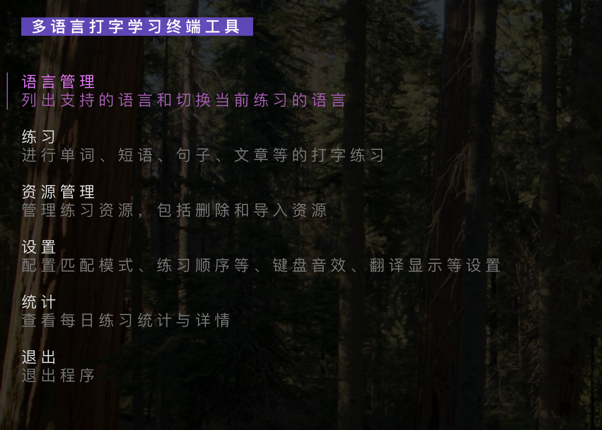

# mllt-cli · Multilingual Language Learning Typing Terminal

> 在终端里沉浸式练习外语输入，兼具 CLI 的效率与 TUI 的友好体验。

`mllt-cli` 是一个使用 Go 编写的跨平台语言学习工具，借助命令行与 Bubble Tea 图形界面实现单词、短语、句子、文章等多维度的打字练习。项目内置资源管理、收藏/标记、间隔重复（SRS）与练习统计功能，可在全终端环境下完成高频巩固。



> **说明**：项目起源于作者的个人学习需求，功能难免存在片面之处，且目前测试覆盖有限。欢迎大家通过 Issue 或 PR 指出问题、提供建议，一起迭代完善。

---

## 目录
- [功能亮点](#功能亮点)
- [快速上手](#快速上手)
- [安装与卸载](#安装与卸载)
- [使用说明](#使用说明)
- [配置](#配置)
- [资源文件](#资源文件)
- [统计与 SRS](#统计与-srs)
- [路线图](#路线图)
- [参与贡献](#参与贡献)
- [项目状态](#项目状态)
- [许可证](#许可证)

## 功能亮点
- **双重交互模式**：Cobra 提供的 CLI 与 Bubble Tea TUI 无缝结合，支持上下箭头、Tab 自动补全与命令提示。
- **多维度练习**：单词、短语、句子、文章四类素材任意切换，可根据练习目标自定义文件夹与资源。
- **资源管理完善**：支持导入、删除、收藏、标记等操作，构建专属词库，练习时时刻保持高频内容。
- **记忆曲线驱动**：内置艾宾浩斯遗忘曲线与 SRS 排序模式，让重点词条得到及时复习。
- **沉浸式练习体验**：可选打字音效、顺序/随机/收藏等多种练习模式，提升学习沉浸感。
- **练习统计回顾**：自动记录每日练习数据，按日期查看次数、正确率与用时，帮助复盘学习节奏。

## 快速上手
1. 确保本地环境满足：
   - macOS / Linux / Windows 终端环境
   - （可选）Go 1.24.0 或更新版本，用于自行构建
2. 获取可执行文件：
   - **推荐**：前往 [Releases](https://github.com/ajilisiwei/mllt-cli/releases) 下载与你平台匹配的包
   - **或** 使用 `go install`：
     ```bash
     go install github.com/ajilisiwei/mllt-cli/cmd/mllt-cli@latest
     ```
3. 将二进制放入 PATH 后执行：
   ```bash
   mllt-cli         # 启动交互式主界面
   mllt-cli --help  # 查看所有命令
   ```

首次运行会在 `~/.mllt-cli`（Windows：`%USERPROFILE%\.mllt-cli`）下自动初始化默认配置、资源与音效文件。

## 安装与卸载
### 下载预编译发行包
自 `v1.0.0` 起提供多平台发行包，压缩包内含可执行文件与资源：

| 平台 | 下载包 | 安装
| --- | --- | ---
| macOS (amd64) | `mllt-cli_v1.0.0_darwin_amd64.tar.gz` | `tar -xzf … && sudo mv mllt-cli /usr/local/bin/`
| macOS (arm64) | `mllt-cli_v1.0.0_darwin_arm64.tar.gz` | 同上
| macOS (universal) | `mllt-cli_v1.0.0_darwin_universal.tar.gz` | 同上
| Linux (amd64) | `mllt-cli_v1.0.0_linux_amd64.tar.gz` | `tar -xzf … && sudo mv mllt-cli /usr/local/bin/`
| Windows (amd64) | `mllt-cli_v1.0.0_windows_amd64.zip` | 解压后将 `mllt-cli.exe` 复制到 PATH 所在目录

下载后可通过 `shasum -a 256 <文件>` 对比 Release 提供的校验值，确认文件完整。

### 使用 go install
本地已安装 Go 时可直接构建：
```bash
go install github.com/ajilisiwei/mllt-cli/cmd/mllt-cli@latest
```
可执行文件将位于 `$GOBIN`（或 `$GOPATH/bin`）。

### 从源码构建
```bash
git clone https://github.com/ajilisiwei/mllt-cli.git
cd mllt-cli
./build.sh            # 输出通用 macOS 可执行文件
sudo ./install.sh     # 将二进制与默认资源安装到系统路径
```

### 卸载
```bash
sudo ./uninstall.sh   # 或手动删除二进制与 ~/.mllt-cli
```

## 使用说明
- 运行 `mllt-cli` 进入主界面，通过方向键选择模块。
- `lang`、`practice`、`manage`、`setting` 模块都可以在 CLI 中直接调用，例如 `mllt-cli practice words`。
- 练习界面可输入 `> help` 查看命令提示，`Tab` 自动补全，`Esc` 返回上一级。

常用命令示例：

| 命令 | 说明 | 示例 |
| --- | --- | --- |
| `mllt-cli lang ls` | 列出支持的语言 | `mllt-cli lang ls` |
| `mllt-cli lang st <language>` | 切换练习语言 | `mllt-cli lang st japanese` |
| `mllt-cli practice words [file]` | 单词练习 | `mllt-cli practice words default/四级单词` |
| `mllt-cli manage import <type> <file>` | 导入资源 | `mllt-cli manage import phrases ~/Downloads/phrases.txt` |
| `mllt-cli manage delete <type> [file]` | 删除资源或文件夹 | `mllt-cli manage delete sentences` |
| `mllt-cli setting order [random|sequential|ebbinghaus]` | 设置练习顺序 | `mllt-cli setting order ebbinghaus` |
| `mllt-cli setting keyboard-sound [enable|disable]` | 打开/关闭键盘音效 | `mllt-cli setting keyboard-sound enable` |
| `mllt-cli setting translation [show|hide]` | 控制正确后是否显示翻译 | `mllt-cli setting translation show` |

### 小贴士
- 使用“收藏”列表整理高频词汇，配合 `> favorite`、`> unfavorite` 命令快速管理。
- 在 SRS 模式下建议每日复习自动排定的内容，保持记忆曲线闭环。
- 可在 `~/.mllt-cli/config.yaml` 调整练习顺序、音效和翻译等行为。

## 配置
安装或首次运行会生成默认配置：
```yaml
languages:
  - english
  - japanese
current_language: english
correctness_match_mode: word_match
next_one_order: ebbinghaus
input_keyboard_sound: true
show_translation: false
```
主要字段说明：
- `languages`：语言列表；在 `lang ls` 中展示并作为资源目录。
- `current_language`：当前练习语言，决定资源根目录。
- `correctness_match_mode`：`exact_match` 或 `word_match`。
- `next_one_order`：`random`、`sequential`、`ebbinghaus`。
- `input_keyboard_sound`：是否播放敲击音效。
- `show_translation`：是否显示翻译。

## 资源文件
- 内置资源位于 `resources/<language>/<type>/<folder>/<file>.txt`。
- 用户资源与练习记录会放在 `~/.mllt-cli/resources` 与 `~/.mllt-cli/user-data`。
- 默认提供《新概念英语》文章、四六级词汇、日常短语等素材，支持日语目录扩展。
- 导入文件需为 UTF-8 `.txt`，每行一个条目，分隔符支持 ` ->> `、制表符、空格、`/`、`:`、`：` 等。

示例：
```
hello ->> 你好
breakfast	早餐
cloud computing 云计算
これはペンです : This is a pen
```

## 统计与 SRS
- 每次练习会在 `~/.mllt-cli/user-data/statistics/<YYYY-MM-DD>.json` 写入记录。
- “统计”模块可按天查看次数、正确率、用时、练习详情。
- SRS 数据位于 `~/.mllt-cli/user-data/srs/<language>/<type>/<file>.json`，正确则延长复习间隔，错误则重置阶段。

## 路线图
- [ ] 增加更多语言的默认资源模板
- [ ] 提供练习统计导出与可视化
- [ ] 支持自定义快捷键与键位布局
- [ ] SRS 与练习进度的云端同步能力
- [ ] CLI 批量导入导出工具

欢迎在 [Discussions](https://github.com/ajilisiwei/mllt-cli/discussions) 或 [Issues](https://github.com/ajilisiwei/mllt-cli/issues) 中投票/留言，路线图会根据反馈持续调整。

## 参与贡献
1. Fork 仓库并创建特性分支
2. 完成改动后运行 `go test ./...`
3. 提交 PR 并在描述中说明改动动机与测试情况

你也可以提交文档、资源文件或示例，帮助更多学习者快速上手。

## 项目状态
- 以个人学习需求为核心，功能仍在快速迭代期
- 缺乏系统化测试，可能存在 Bug 或边界情况未覆盖
- 如果发现问题，请通过 Issue 告知，或附带复现步骤提交 PR

## 许可证
[MIT](./LICENSE)

---

如果 `mllt-cli` 对你有帮助，欢迎 Star ⭐️、分享给身边的语言学习伙伴，或在 Issue 中告诉我们你的实践心得！
