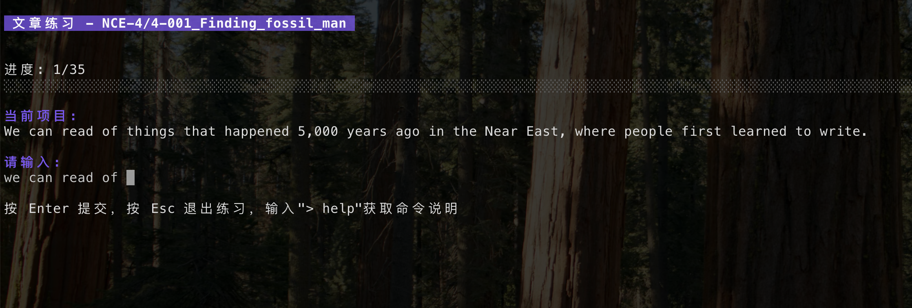

# 语言学习打字终端 (lang-cli)

`lang-cli` 是一个基于 Go 构建的终端语言学习工具，提供命令行与 Bubble Tea TUI 双重体验，帮助多语言学习者通过单词、短语、句子与文章的打字练习巩固记忆。项目内置资源管理、收藏/标记、键盘音效、练习统计以及基于艾宾浩斯遗忘曲线的间隔重复算法，适用于持续迭代的个人学习流程。

## 目录
- [功能亮点](#功能亮点)
- [快速开始](#快速开始)
- [安装与卸载](#安装与卸载)
- [使用说明](#使用说明)
- [配置](#配置)
- [资源文件](#资源文件)
- [统计与 SRS](#统计与-srs)
- [开发与构建](#开发与构建)
- [许可证](#许可证)

## 功能亮点
- 终端友好体验：基于 Cobra 的 CLI 与 Bubble Tea 的交互式界面，支持上下箭头选择、Tab 自动补全与命令提示。
- 多样化练习：在单词、短语、句子、文章四种资源之间切换，支持翻译显示以及即时正确性反馈。
- 资源管理完备：资源按语言与文件夹组织，可通过导入/删除操作维护本地素材，还可收藏或标记条目以便后续复习。
- 间隔重复支持：开启 `next_one_order = ebbinghaus` 后会按照艾宾浩斯遗忘曲线安排练习顺序（文章资源除外）。
- 可选键盘音效：内置 `assets/keyboard-sound.wav`，练习时可模拟真实打字反馈。
- 数据沉淀：自动记录每日练习统计，支持在界面中按日查看练习次数、正确率、耗时等信息。

## 快速开始
1. 准备环境
   - Go 1.24.0 或更新版本
   - macOS/Linux/Windows 终端环境
2. 安装可执行文件
   ```bash
   go install github.com/daiweiwei/lang-cli@latest
   # GOPATH/bin 需要在 PATH 中
   ```
3. 运行工具
   ```bash
   lang-cli         # 启动交互式主界面
   lang-cli --help  # 查看命令行帮助
   ```

## 安装与卸载
### 使用 go install
最简单的方式是通过 `go install` 获取最新版：
```bash
go install github.com/daiweiwei/lang-cli@latest
```
`lang-cli` 会被安装到 `$GOPATH/bin`（或 `$GOBIN`）。首次运行时工具会自动在 `~/.lang-cli` 下创建配置、资源与用户数据目录。

### 从源码构建与安装
1. 克隆仓库并构建
   ```bash
   git clone https://github.com/daiweiwei/lang-cli.git
   cd lang-cli
   ./build.sh
   ```
   `build.sh` 会生成针对 macOS arm64/amd64 的二进制，并尝试使用 `lipo` 创建通用版本。
2. 安装到系统路径并初始化资源
   ```bash
   sudo ./install.sh
   ```
   `install.sh` 会将可执行文件复制到 `/usr/local/bin/lang-cli`，并将默认配置、内置资源与音效复制到 `~/.lang-cli`。

### 卸载
- 使用脚本：
  ```bash
  sudo ./uninstall.sh
  ```
  按提示确认后会删除可执行文件及 `~/.lang-cli` 目录。
- 手动卸载：
  ```bash
  sudo rm /usr/local/bin/lang-cli
  rm -rf ~/.lang-cli
  ```

## 使用说明
### 启动终端界面
直接运行 `lang-cli` 可进入主菜单，使用上下箭头选择模块，`Enter` 确认，`Esc` 可返回上一级，`Ctrl+C` 随时退出。

### 界面预览
- **主菜单**：列出语言管理、练习、资源管理、设置与统计等入口，顶部标题展示“多语言打字学习终端工具”。

  

- **练习模块入口**：按照单词、短语、句子、文章分类展示练习选项，可随时返回主菜单。

  

- **练习命令提示**：在打字练习过程中于界面下方提示可用命令（例如 `> mark`、`> favorite`），同时显示当前进度与待输入内容。

  

- **文章练习视图**：呈现长文本逐句输入的界面，顶部为资源路径与进度，正文区域显示当前需要输入的句子，底部保留快捷键提示。

  

### 常用命令
| 命令 | 说明 | 示例 |
| --- | --- | --- |
| `lang-cli lang ls` | 列出支持的语言，当前语言会以 `✔` 标记 | `lang-cli lang ls` |
| `lang-cli lang st <language>` | 切换练习语言并保存配置 | `lang-cli lang st japanese` |
| `lang-cli practice words [file]` | 单词练习，未指定文件时列出可选资源 | `lang-cli practice words default/四级单词` |
| `lang-cli manage import <type> <file>` | 导入 `.txt` 资源到默认文件夹 | `lang-cli manage import phrases ~/Downloads/phrases.txt` |
| `lang-cli manage delete <type> [file]` | 删除资源或列出待删文件 | `lang-cli manage delete sentences` |
| `lang-cli setting match-mode [exact_match|word_match]` | 设置答案判定模式 | `lang-cli setting match-mode exact_match` |
| `lang-cli setting order [random|sequential]` | 设置随机或顺序练习（TUI 中可选 `ebbinghaus`） | `lang-cli setting order random` |
| `lang-cli setting keyboard-sound [enable|disable]` | 开关键盘音效 | `lang-cli setting keyboard-sound disable` |
| `lang-cli setting translation [show|hide]` | 控制正确后是否显示翻译 | `lang-cli setting translation show` |

### 练习会话内命令
在交互式练习界面中，以 `> 命令` 形式输入可获得更多能力：
- `> exit`：立即结束当前会话并返回练习列表。
- `> help`：查看所有支持的会话命令。
- `> mark` / `> unmark`：将当前条目标记为需跳过或取消标记。
- `> favorite` / `> unfavorite`：收藏或取消收藏当前条目，收藏内容在资源列表中以“收藏”文件夹呈现。

正确输入会根据配置展示翻译；在输入框中按 `Tab` 可快速选择提示命令；输入 `Esc` 或在结果页按 `Enter` 可返回上一级菜单。

## 配置
安装或首次运行后会在以下路径生成配置文件：
- 开发环境：`config/config.yaml`
- 安装后的用户环境：`~/.lang-cli/config.yaml`

示例配置：
```yaml
languages:
  - english
  - japanese
current_language: english
correctness_match_mode: word_match   # exact_match | word_match
next_one_order: ebbinghaus           # random | sequential | ebbinghaus
input_keyboard_sound: true
show_translation: false
```

主要选项说明：
- `languages`：可练习语言列表，会在语言管理模块中显示。
- `current_language`：当前练习语言，决定默认资源路径。
- `correctness_match_mode`：`exact_match` 需完全匹配；`word_match` 支持基于单词的宽松匹配。
- `next_one_order`：控制下一个条目的出现顺序；设置为 `ebbinghaus` 时启用间隔重复算法（CLI 命令目前仅暴露 `random/sequential`，可在 TUI 设置或直接编辑配置启用 `ebbinghaus`）。
- `input_keyboard_sound`：是否播放键盘音效。
- `show_translation`：回答正确后是否显示翻译文本。

## 资源文件
### 资源类型
| 类型 | 目录名 | 用途 |
| --- | --- | --- |
| 单词 | `words` | 单词或短语的拼写练习 |
| 短语 | `phrases` | 常用短语表达 |
| 句子 | `sentences` | 日常表达/商务沟通句子 |
| 文章 | `articles` | 长文本段落练习，记录按句切分 |

### 存储结构
- 内置资源位于仓库 `resources/<language>/<type>/<folder>/<file>.txt`。
- 安装后所有资源会同步到 `~/.lang-cli/resources`，用户新增资源也保存在此处。
- 支持按文件夹组织资源，默认文件夹名称为“默认”，对应目录名 `default`。
- 用户数据（练习记录、SRS 计划等）位于 `~/.lang-cli/user-data`。

### 默认资源
- 英语资源：`english/articles` 目录内置《新概念英语》第一册到第四册的逐句文本，`words/default` 提供四六级及计算机常用词汇，`phrases/default` 与 `sentences/default` 收录日常对话素材。
- 日语资源：预留了 `japanese/*` 目录结构，方便后续添加文章、短语和句子练习内容。
- 系统默认资源会根据学习需求不定期更新，建议定期同步仓库或重新执行安装脚本以获取最新版本。
- 默认素材中包含部分由 AI 辅助生成或校对的内容，可能存在语义或拼写偏差，练习时请自行甄别并与权威材料交叉验证。
- 用户自行导入的资源存放在 `~/.lang-cli/resources` 下的用户目录，更新默认资源时不会覆盖这些文件；安装脚本在合并资源时也会跳过用户已有的同名内容。

### 文件格式
- 文件需为 UTF-8 编码的 `.txt` 文本，每行一个练习条目。
- 支持的分隔符包含：` ->> `、制表符、单个空格、`/`、`:`、`：`（会自动按优先级解析）。
- 未提供分隔符时整行视作原文，翻译为空。

示例（`words/default/sample.txt`）：
```
hello ->> 你好
breakfast	早餐
cloud computing 云计算
これはペンです : This is a pen
```

导入资源时，可通过命令或 TUI 选择目标文件夹：
```bash
lang-cli manage import words ~/Downloads/vocabulary.txt
```
删除或清理资源时可在 TUI 中逐级选择语言、类型、文件夹后确认删除；只有空文件夹可被移除，默认文件夹不可删除。

## 统计与 SRS
- 练习结束后会在 `~/.lang-cli/user-data/statistics/<YYYY-MM-DD>.json` 中记录会话详情。
- 主菜单“统计”页面可按日期查看练习次数、正确率、耗时与历史会话列表。
- 当 `next_one_order` 设置为 `ebbinghaus` 且资源类型非文章时，会在 `~/.lang-cli/user-data/srs/<language>/<type>/<file>.json` 维护间隔重复计划，正确回答将延长复习间隔，错误则重置阶段。
- 标记或收藏条目会即时更新 SRS 队列，确保下次练习跳过或聚焦重点内容。

## 开发与构建
- 构建：`go build ./cmd/lang-cli`
- 运行测试：`go test ./...`
- 代码结构：
  - `cmd/lang-cli`：命令行入口。
  - `internal/ui`：Bubble Tea 交互界面。
  - `internal/practice` / `internal/manage`：资源读取、练习与导入逻辑。
  - `internal/statistics` / `internal/srs`：统计与间隔重复实现。
  - `assets`、`resources`：音效与示例资源。

欢迎通过 issue 或 pull request 贡献新特性、资源或改进文档。

## 许可证
[MIT](./LICENSE)
